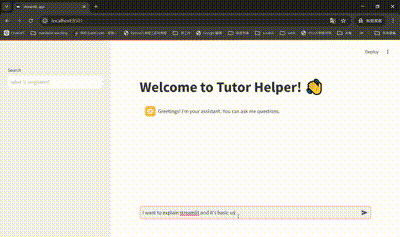
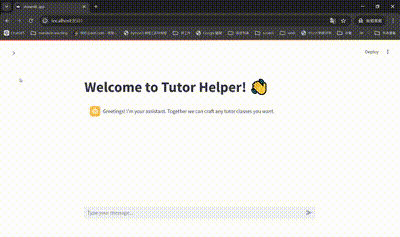

This is a tutor assistant powered by LLM.
The goal is to create a tool that can support a tutor in managing their teaching tasks, enhance student engagement, and streamline administrative tasks. 

### DEMO



### Functions
   
- **Answering Questions**: The assistant should be able to answer frequently asked questions related to the subject being taught. This could involve automated explanations, quick facts, or resources.
- **Provide Explanations**: Help tutors explain complex concepts to students in simpler terms. For example, the assistant could break down difficult concepts or suggest alternative ways of explaining a topic.
- **Study Plans**: Create personalized study plans for students, adapting to their learning pace and weaknesses. This can be based on their previous performance or goals set by the tutor.
- **Automated Feedback**: After each tutoring session or assignment, the assistant can generate automated feedback for the student based on their performance, including suggestions for improvement.
- **Session Summaries**: Generate and send summaries of tutoring sessions to both tutors and students, outlining what was covered, what needs further review, and next steps.
- **Customized Search**: enhance the search term and search multiple resources at the same time


### Installation
#### Prerequisite
- OpenAI key
- Python >= 3.12

1. clone the repository
   ```
   git clone git@github.com:yvetteTsai22/tutor_helper.git
   ```
2. create .env
   ```
   BACKEND_URL=127.0.0.1:8000
   OPENAI_API_KEY=<YOUR KEY>
   ```

#### local
3. install packages
   ```
   cd tutor_helper/
   pipenv shell
   pipenv install -r requirements.txt
   pipenv install -e ./
   ```
4. start fastAPI
   ```
   cd tutor_helper/
   uvicorn tutor_helper.use_cases.fastapi:app --reload
   ```
5. start strealit
   ```
   streamlit run tutor_helper/use_cases/streamlit_app.py
   ```

You should see the app in http://localhost:8501/.


### Tests
One can test the code from the UI or with simple tests with pytest.
```
python tests/test_fastapi.py
```